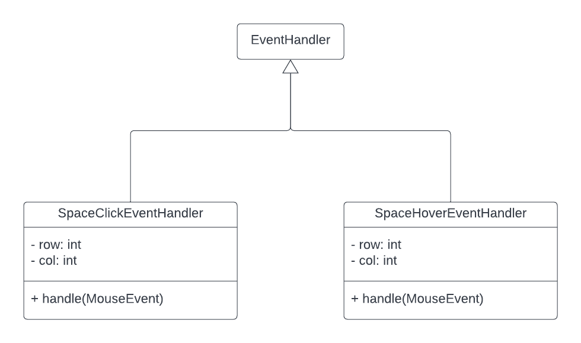

# Design

Since features will be iteratively added to the project, I want to ensure that my project is modifiable and well-designed.
To do so, I'll be implementing a variety of well-known design patterns, many of which are described in *Design Patterns*.
I'll be specifying the design in UML as both structural and behavioral diagrams.

## Structural

### Component Diagram

The overall architectural style that I chose for this project is the Model-View-Controller (MVC) style.
The rationale behind this choice was that MVC is the most popular architectural style, and Java's built-in Observer and Observable interfaces make it simple to bind the view to the model.

### Class Diagram - View Component

There isn't much of an explanation needed here.
The application has a single scene, which is a TilePane which is composed of StackPanes that contain images of each of the pieces of the board.

### Class Diagram - Controller Component

The controller component is composed of two event handlers. 
One of them is for when the user clicks on a space on the board, the other is for when the user hovers over a space.

### Class Diagram - Model Component

To construct the above class diagram, I started with an Object-Oriented Analysis (OOA), which led me to develop a ChessGame class, a Space class, and a Piece class.
Each piece can be moved in a slightly different way, so I created an abstract class with concrete classes for each type of piece.
To distribute the workload over the many classes, I chose to have the methods for moving pieces included in the Piece class and the corresponding subclasses.
To move a piece, you call the move method in the ChessGame class, which calls the move method for the corresponding piece, which then operates on the ChessGame object.
Cyclic dependencies like this are typically frowned upon in designs, but if we omit this, all the code for moving pieces will be in the ChessGame class which will clutter it.
Therefore, I chose to keep the cyclic dependency as a trade-off.

The Colors enumeration is used to keep track of the player's colors, and the Pieces enumeration is for returning the state of the board in the getBoardState() method and for setting the initial board in the ChessGame constructor.

To build the initial board state, I chose to implement a builder class according to the builder design pattern. There's nothing particularly interesting here, that class just builds the board and the board's spaces.

One of the most difficult aspects of this game to implement is that a player's turn can't end with them in check. 
I chose to handle this by keeping track of how a board's state changes as moves are made with a memento class, as described in the memento design pattern.
Typically, the memento class would store the entire state of the originator class, but this is unnecessary for my application since only a handful of spaces can be changed at a time.
Therefore, the memento only keeps track of the set of spaces that were changed.
When a move is made, the move method from the Piece class will return the original state of the spaces that were changed, which will then be stored in a MoveMomento object.
To check if a move ends with the current player in check, we'll make the move, check if it ends in check, and then revert the state of the board back to the way it was prior to the move being made with the unexecuteLastMove method. 

## Behavioral

For the behavioral diagrams, there's no need to create a use case diagram since there's just a single actor, the user, and there's only two ways for the user to interact with the application, either by hovering over a space or by selecting it.

Instead, I'll be creating some sequence diagrams for the more complicated methods in the ChessGameInterface.

Please note that many details have been removed from the following diagrams to keep them concise.
Creating a diagram for each and every method would also take an obscene amount of time, so many methods have been omitted.

### *getAvailableMoves* Sequence Diagram

To get the available moves for a particular piece, we need to look at all of the spaces it could normally move to, check if that space isMovable() (which means that it does not contain a piece of the same color), and then make sure that the move wouldn't put the current player in check.
Since each piece has different spaces that are available to move to, I've only included one method in the sequence diagram to understand how each of those methods would work.

### *move* Sequence Diagram

To move a piece from one space to another on the board, the game will get the piece from the space that's being moved from and call the move method for it.
Then, the game will create and store a momento so that it can revert back to the previous space if need be.
