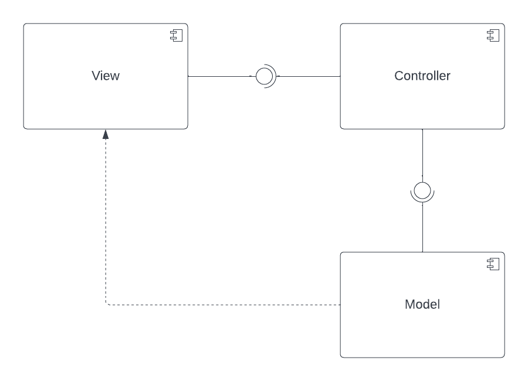
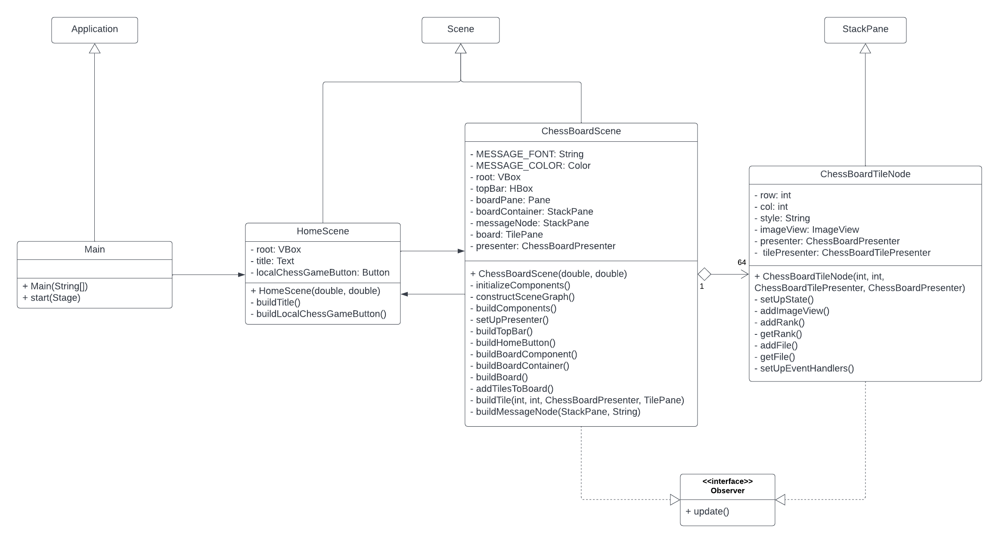
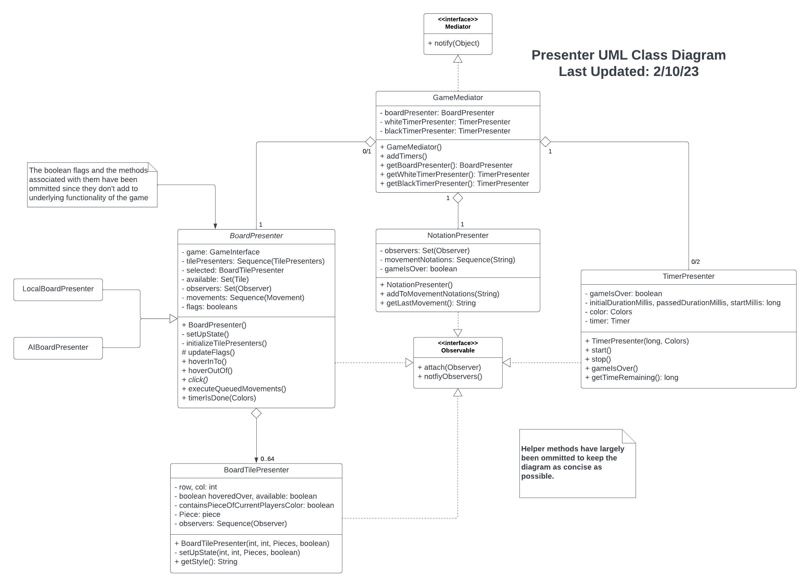
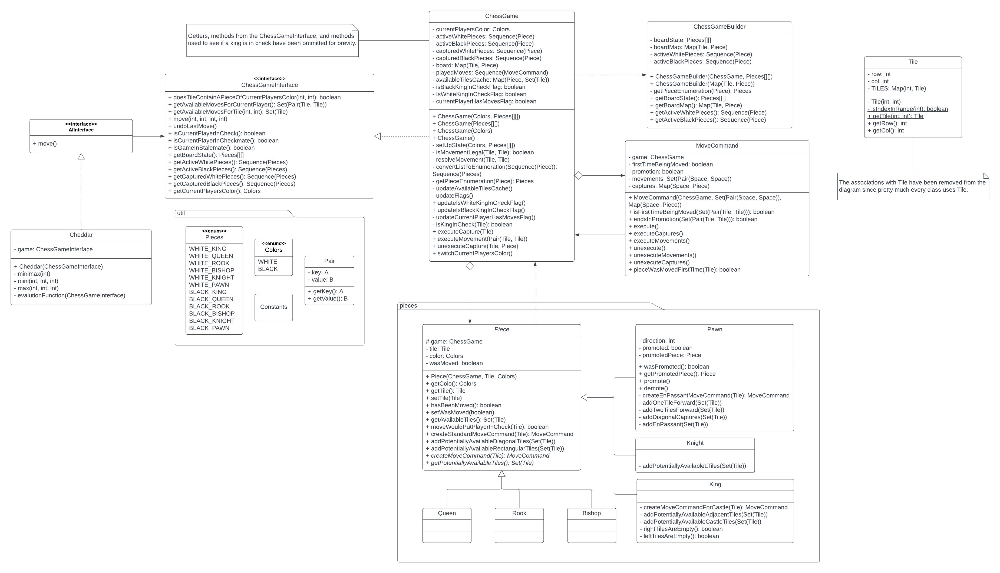
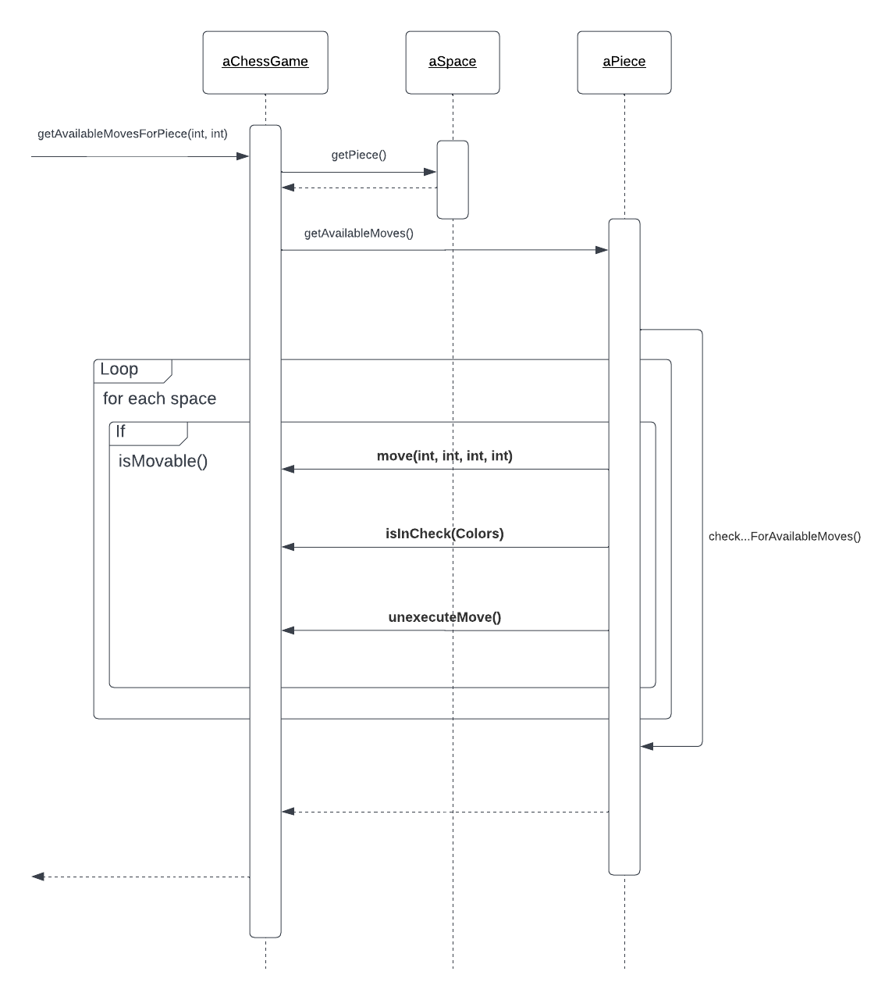
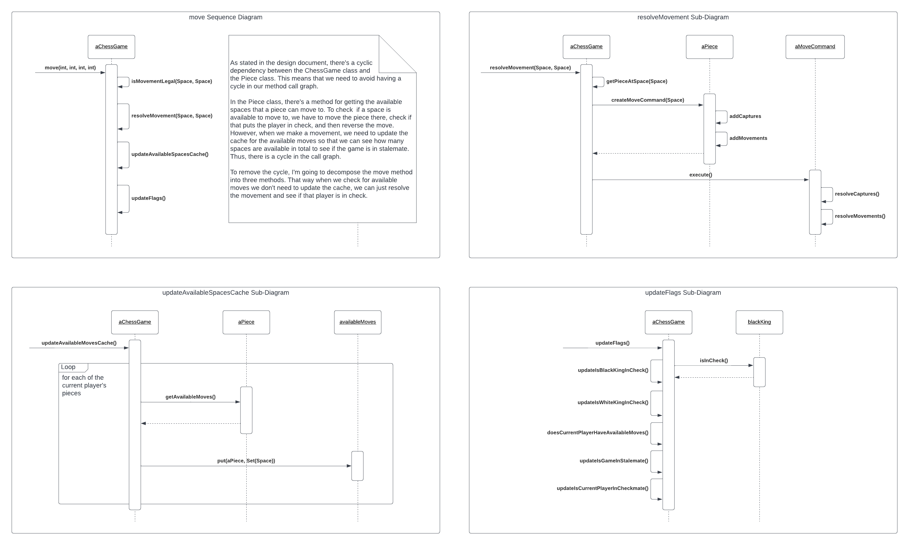

# Design

Since features will be incrementally added to the project, I want to ensure that my project is modifiable and well-designed.
To do so, I'll be implementing a variety of well-known design patterns, many of which are described in *Design Patterns*.
I'll be specifying the design in UML as both structural and behavioral diagrams.

## Structural

### Component Diagram

The overall architectural style that I chose for this project is the Model-View-Presenter (MVP) style.
My goal is to isolate the model component from the GUI framework to assist in testing and development, so that changes to one component don't affect another.
While the MVC architectural style is the most popular, it couples the model and the view which is what I'm trying to avoid.
By using the MVP style, the model component is isolated, and so is the view.
It also allows me to test the presenter to make sure data is being presented in the view correctly, should I choose to start testing the GUI.

### Class Diagram - View Component

The view component consists of a ChessBoardScene, which is composed of ChessBoardTileNodes.
Each of these implements the Observer interface.
We can then attach these objects to presenters so that when the presenters' states are updated, the view is updated as well.

More details on the Observer design pattern can be found in *Design Patterns*.

### Class Diagram - Presenter Component

The presenter component consists of presenters for the chess board and each tile in the chess board.
Each of these implements the Observable interface so that each time the state of these presenters is modified, the corresponding observers are updated.

### Class Diagram - Model Component

The ChessGameInterface defines how the model component can be interacted with by the presenter component.

The class diagram for the model component was initially developed using object-oriented analysis.
This led to the construction of the ChessGame class, the Piece class (and subclasses), and the tile class.
Since the construction of the chess board is rather complicated, a ChessBoardBuilder class was created to handle that process, as well as the process of creating a 2D array of pieces to display the state of the board.

In order to see if a movement is legal, we have to check if making that movement would put the current player in check.
To handle this, the game needs to be able to undo the last move.
To incorporate this functionality, a MoveCommand class was created.

More details on the Builder and Command design patterns can be found in *Design Patterns*.

## Behavioral

For the behavioral diagrams, there's no need to create a use case diagram since there's just a single actor, the user, and there's only two ways for the user to interact with the application, either by hovering over a space or by selecting it.

Instead, I'll be creating some sequence diagrams for the more complicated methods in the ChessGameInterface.

Please note that many details have been removed from the following diagrams to keep them concise.
Creating a diagram for each and every method would also take an obscene amount of time, so many methods have been omitted.

### *getAvailableMoves* Sequence Diagram

### *move* Sequence Diagram

