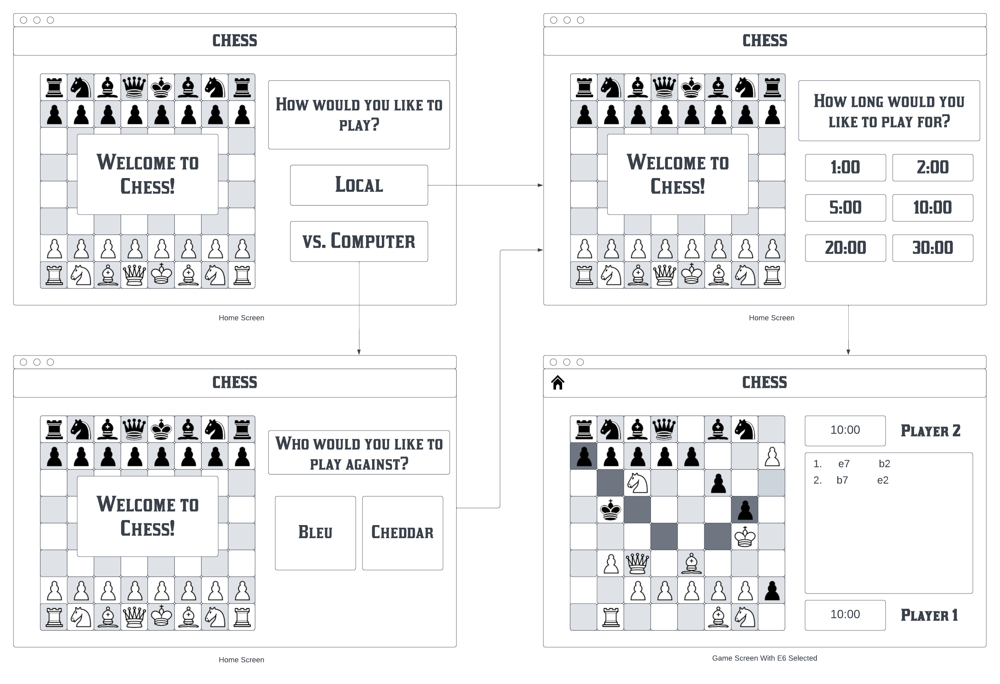

# Problem Description

The application being built is a Chess application that allows two users to play chess on a single device locally.

When the application is launched, a window will be displayed with the initial state of a chess board, with white pieces on bottom and black pieces on top.

## Rules
The game will be played according to standard chess game rules as follows:
- The game is has two colors corresponding to each player, white and black.
  - White *always* gets the first turn, and the players alternate turns.
- On a turn, a player can select any one of their pieces and move them according to the following rules:
  - The **King** can move to any adjacent square (including diagonals).
    - If that space contains an opposing piece, that piece will be captured.
    - If that space contains a piece of the same color, you cannot move to that space.
    - If it hasn't been moved yet, one of the rooks hasn't been moved yet, the spaces between them are empty, and the king isn't currently in check, you can perform a *castle*.
      - In a *castle*, move the king two spaces towards the rook, and move the rook to the opposite side of the king.
  - The **Queen** can move along and diagonal or rectangular vectors until it gets to another piece.
    - If that piece belongs to the opposing player, that piece can be captured.
    - If that piece belongs to the same player, you cannot move to that space.
  - The **Rook** moves along rectangular vectors just as a queen does.
  - The **Bishop** moves along diagonal vectors just as a queen does.
  - The **Knight** moves in an L shape. 
  This means that it moves two spaces according to one rectangular vector, and one space that's orthogonal to that vector.
    - If that space contains an opposing piece, that piece will be captured.
    - If that space contains a piece of the same color, you cannot move to that space.
  - The **Pawn** can move in multiple ways:
    - It can move one space forward if that space does not contain a piece.
    - It can move two spaces forward if it hasn't been moved yet and both spaces in front of it do not contain a piece.
    - It can move forward diagonally if that space contains an opposing piece, in which case it captures that piece.
- The above moves are only valid if they do not put the current player's king in *check*.
    - A player's king is in check if that king can be captured on the next turn.
- If the turn ends with a pawn on the opposite end of the board, the player can promote it to either a queen, rook, bishop, or knight.
    - To keep the application simple, a pawn will automatically be promoted to a queen.
- Turns alternate until the game ends. A game ends when either one of the players is in checkmate, or if there's a stalemate.
  - Checkmate occurs when a player has no remaining moves and their king is in check.
  - Stalemate occurs when the current player has no remaining moves.

## User Interface

There's only one screen to deal with in the game, which contains the board.

Only the current player can select a piece. When the current player hovers over a selectable space, that space will be highlighted.
- A space is selectable if it contains that player's piece, or if the player's currently selected piece can move to that space.

When a player selects a piece, all of the spaces it can move to should be highlighted.

If a piece is selected and the user selects a space that it can be moved to, then that piece will be moved there and the next player can take their turn.

If the game ends with a checkmate, a message should be displayed indicating which player won.
If the game ends with a stalemate, a message should be displayed indicating that there was a tie.

### User Interface Design

